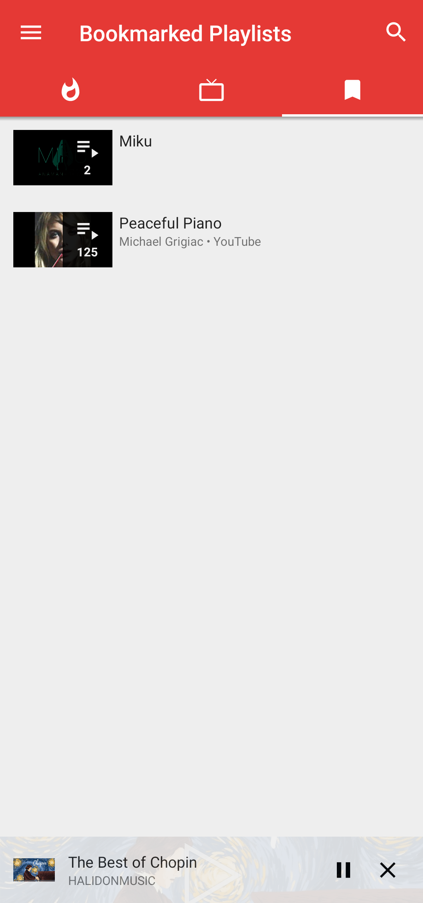
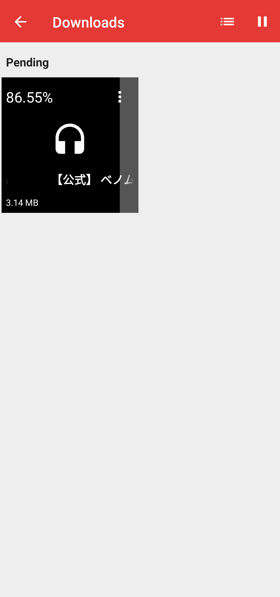

This project has been migrated to CodeBerg. Who want a Microsoft-controled GitHub?

 
<h2 align="center"><b>AnimePipe</b></h2>
<h4 align="center">
A fork of <a href="https://github.com/TeamNewPipe/NewPipe">NewPipe</a> with more services, client features and bug fixes.</h4>

## Services List:

* BiliBili (Actively maintained)
* NicoNico (Actively maintained)
* Youtube (Only significant updates will be merged from upstream)
* SoundCloud (Not maintained)
* media.ccc  (Not maintained)
* Bandcamp   (Not maintained)
* Peertube   (Not maintained)

## Screenshots

 

 

## New Client Features:

* Bullet comments/Live Chats
* One-click starting a shuffled playlist
* Click-to-play at playlist page
* Show comments of replies
* Search filters
* Sort playlists
* Remove duplicate items of local playlists
* Open timestamp in the main player

## Contribute

Issues and PRs are welcomed. Any service related to otaku culture, and any new features making user experience more comfortable are welcomed.

⚠️Warning: This fork is already far from the main repo. You may have to spend a considerable amount of time resolving conflicts.

If you want to contribute your translation, see [TRANSLATION.md](TRANSLATION.md).

## Note

This repo exists originally because BiliBili service is rejected by the team due to censorship concerns. Please **DO NOT** raise any issue about merging new services to upstream in this repo, [TeamNewPipe/NewPipe](https://github.com/TeamNewPipe/NewPipe), or [TeamNewPipe/NewPipeExtractor](https://github.com/TeamNewPipe/NewPipeExtractor/). It is **MEANINGLESS** and a **WASTE OF TIME** for the maintainers.

About merging the new features and fixes to upstream: My coding style is very casual and self-centered. I don't want to do any modification to fit other projects or ask for others to accept my merge request. If you want that, **DO NOT** raise any issue in this repo. **DO IT YOURSELF**.

This project is mainly for my personal use. If you raise an issue I won't encounter, I may not make any fixes.

This repo is **NOT** the orginal repo of Newpipe, and will **NOT** always keep up with the latest version of the original repo.

This repo can **NOT** ensure every service is available. PeerTube, Bandcamp, SoundCloud and media.ccc.de are not maintained as I don't use them and they are not related to otaku culture. Youtube is still maintained, though only significant updates will be merged from upstream. For the best user experience browsering Youtube, please check the upstream [NewPipe](https://github.com/TeamNewPipe/NewPipe) or another fork [NewPipe x SponsorBlock](https://github.com/polymorphicshade/NewPipe)

## Special Thanks

[SocialSisterYi/bilibili-API-collect](https://github.com/SocialSisterYi/bilibili-API-collect) for providing BiliBili API lists.

[AioiLight](https://github.com/AioiLight) for providing some of the code of NicoNico service.
