

 
<h2 align="center"><b>PipePipe</b></h2>
<h4 align="center">
NewPipe, reimagined: faster, more stable, and packed with more features.</h4>

## Beyond NewPipe

#### YouTube Enhancements
* Integrate SponsorBlock for skipping sponsored segments (YouTube & BiliBili) 
* Restore YouTube dislikes with ReturnYouTubeDislike 
* Show original titles on YouTube (non-localized) 
* Log in to access restricted or premium content 

#### Media Features
* Display live chats in danmaku-style overlays
* Support AV1 and VP9 codecs for efficient, high-quality playback 
* Enable music player mode with background playback 

#### Filtering
* Apply advanced search filters for better discovery 
* Filter out unwanted items by keywords or channels 
* Block shorts and paid videos for a cleaner feed 

#### Playback Controls
* Use swipe-to-seek and fullscreen gestures for intuitive navigation 
* Long-press to speed up playback 
* Set a sleep timer for bedtime listening 

#### Enhanced Playlists
* Download full playlists at once 
* Search and sort within local playlists and histories

... and many more improvements!

## Screenshots

[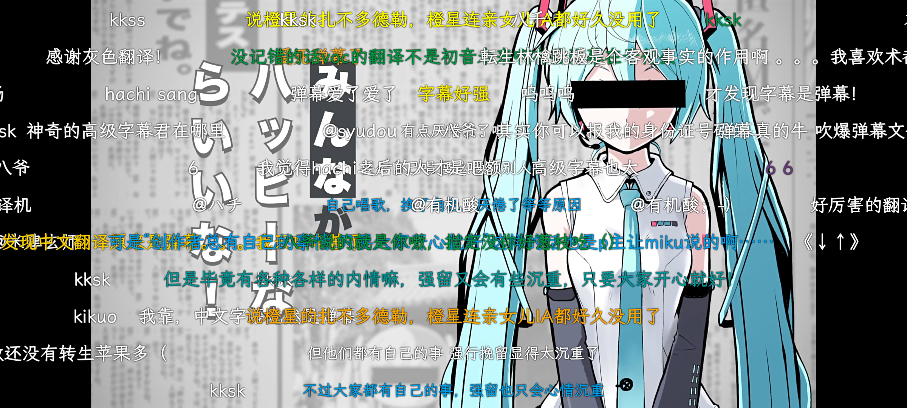](fastlane/metadata/android/en-US/images/phoneScreenshots/00-v1.png)

[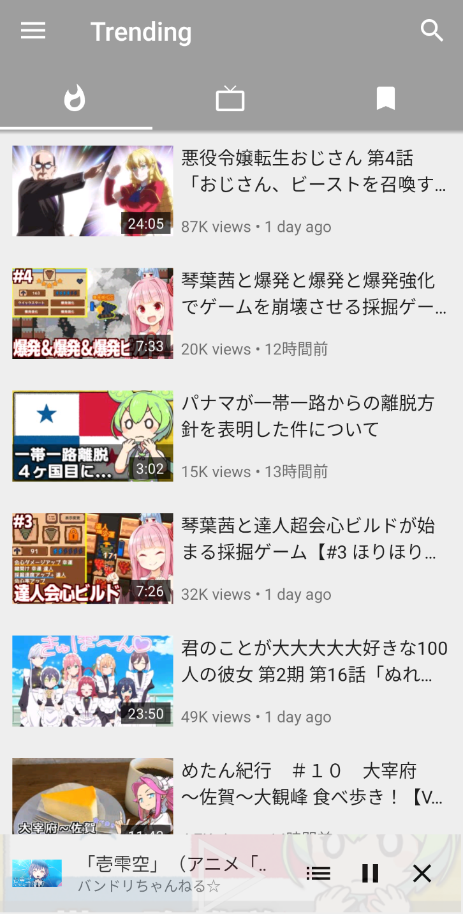](fastlane/metadata/android/en-US/images/phoneScreenshots/01-v3.png)
[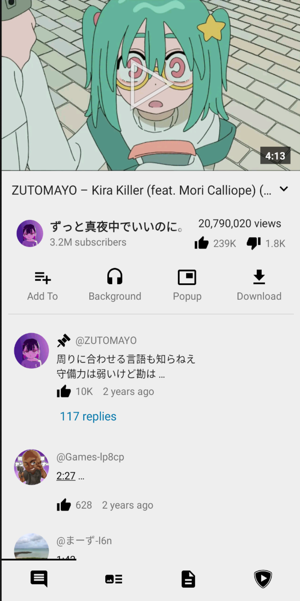](fastlane/metadata/android/en-US/images/phoneScreenshots/02-v3.png)
[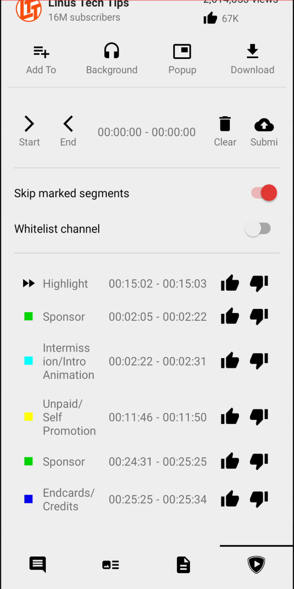](fastlane/metadata/android/en-US/images/phoneScreenshots/03-v3.png)
[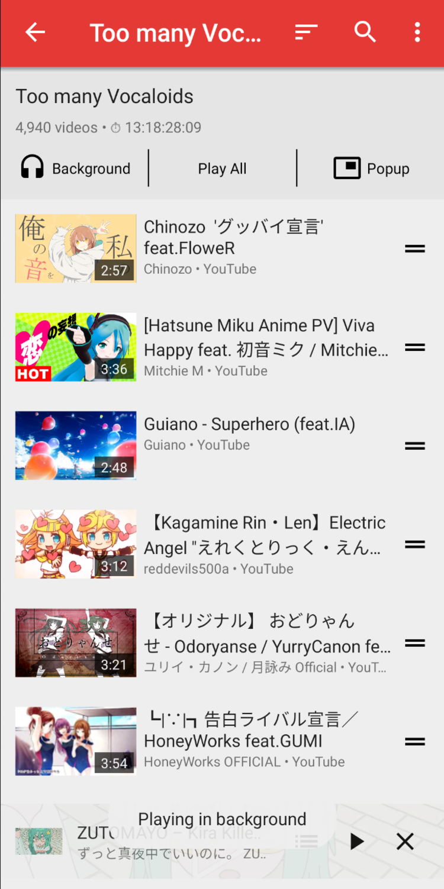](fastlane/metadata/android/en-US/images/phoneScreenshots/04-v3.png)
 
[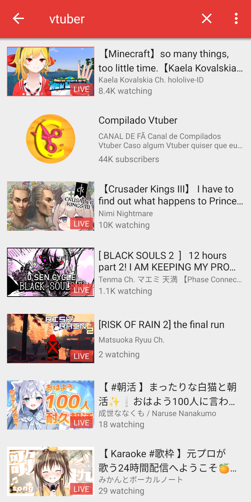](fastlane/metadata/android/en-US/images/phoneScreenshots/05-v3.png)

[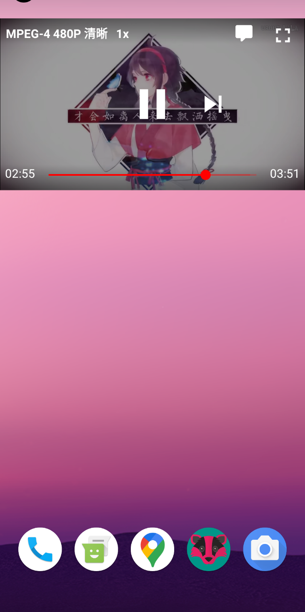](fastlane/metadata/android/en-US/images/phoneScreenshots/07-v3.png)
[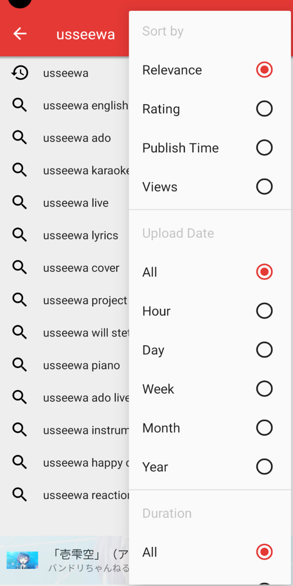](fastlane/metadata/android/en-US/images/phoneScreenshots/08-v3.png)
 
[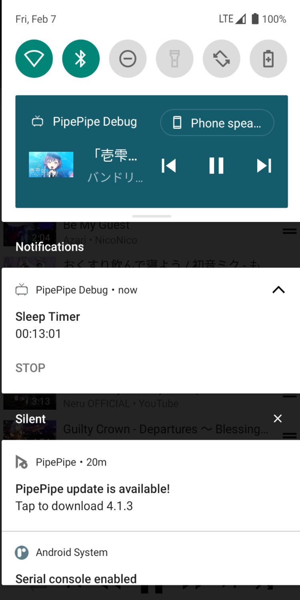](fastlane/metadata/android/en-US/images/phoneScreenshots/09-v3.png)

[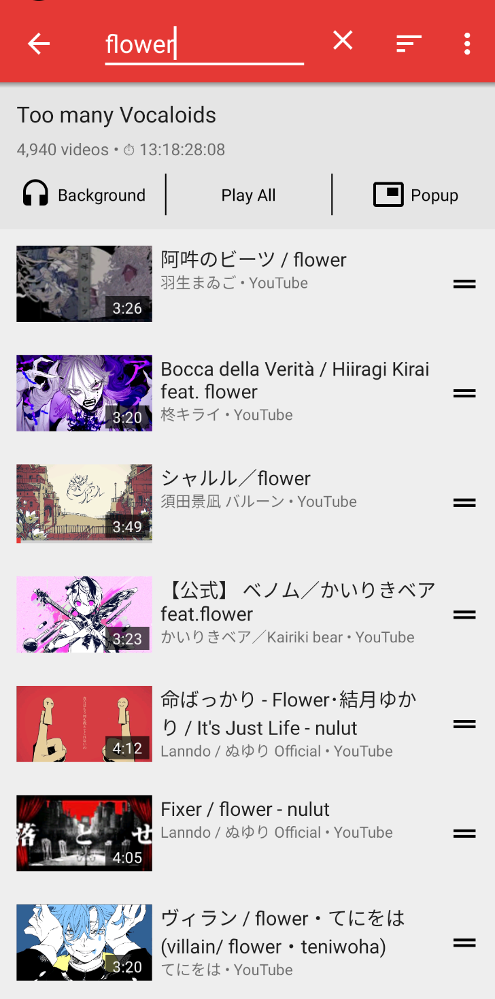](fastlane/metadata/android/en-US/images/phoneScreenshots/11-v3.png)
[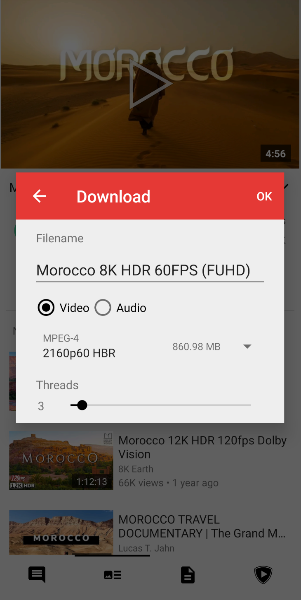](fastlane/metadata/android/en-US/images/phoneScreenshots/12-v3.png)

## About this fork

Due to differences in development philosophy, I forked NewPipe in early 2022 and began independent development based on it.

This means that PipePipe neither receives updates from NewPipe nor pushes updates to NewPipe. They have become two separate projects. Issues that occur in NewPipe don't necessarily happen in PipePipe, and changes made in NewPipe may not be adopted by PipePipe. In contrast, forks like Tubular track the latest version of NewPipe and develop based on it.

Making a hard fork allows us to effectively address issues with quick fixes and maintain frequent feature updates.

## About sign in

PipePipe will ONLY use the login cookie for the specified scenarios you set. You can configure it in "Cookie Functions."

For YouTube, the cookie will only be used when retrieving playback streams.

## Contribute

Issues and PRs are welcomed. Please note that I will **NOT** accept service requests. 

Anyone interested in creating their own service is encouraged to fork this repository.

## Donation

If you find PipePipe useful, please consider becoming a supporter on Ko-Fi. Your support is important to me and helps me add more exciting new features. Every bit counts! 😇

Liberapay: https://liberapay.com/PipePipe

Ko-fi: https://ko-fi.com/pipepipe

## Community

[PipePipe Wiki](https://priveetee.github.io/Docs-PipePipe) User wiki maintained by [@Priveetee](https://github.com/Priveetee)

## Special Thanks

[SocialSisterYi/bilibili-API-collect](https://github.com/SocialSisterYi/bilibili-API-collect) for providing some BiliBili API lists.

[AioiLight](https://github.com/AioiLight) for providing some code of NicoNico service.
