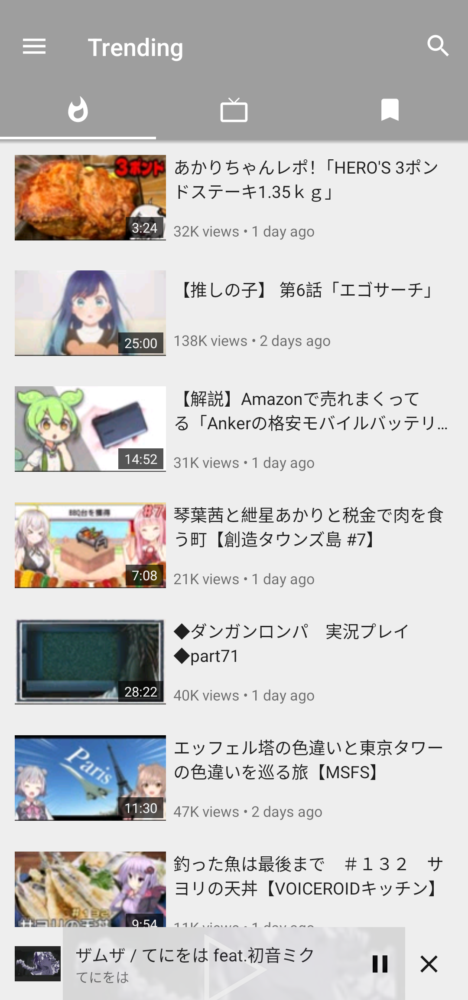
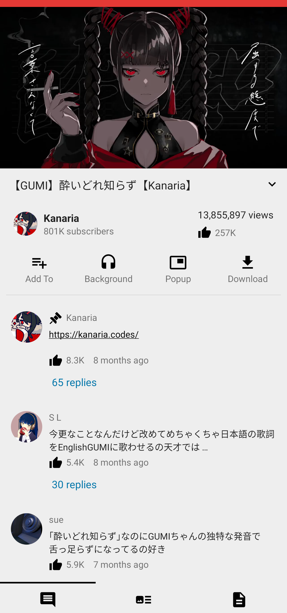
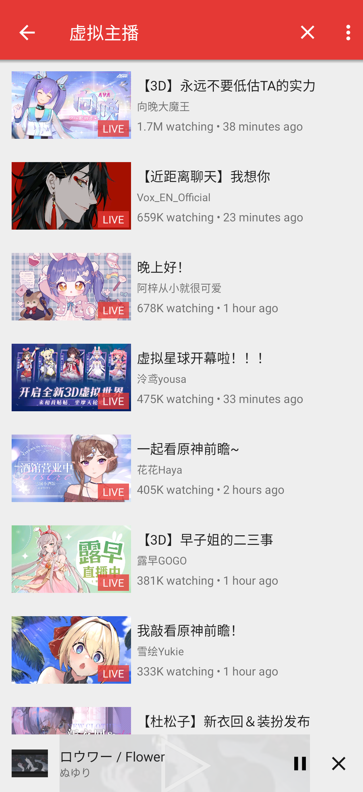
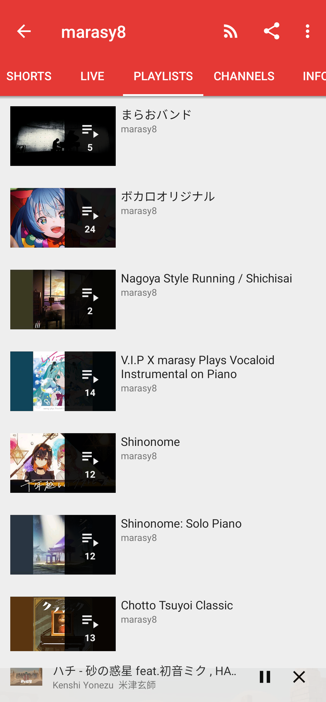
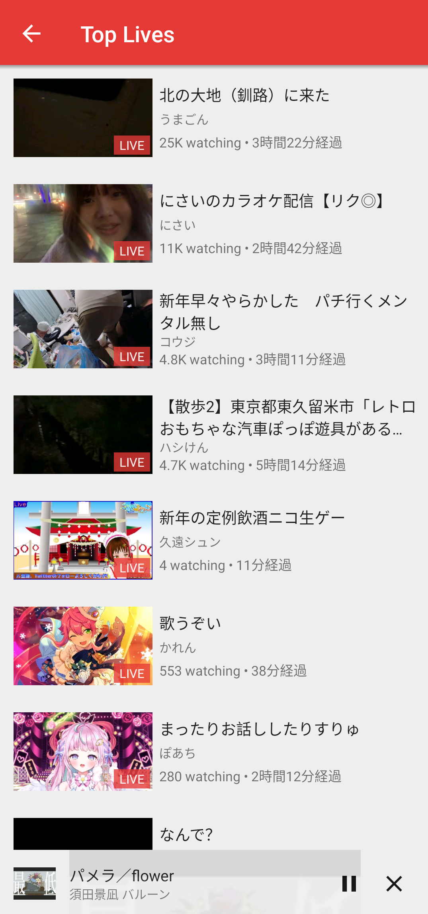
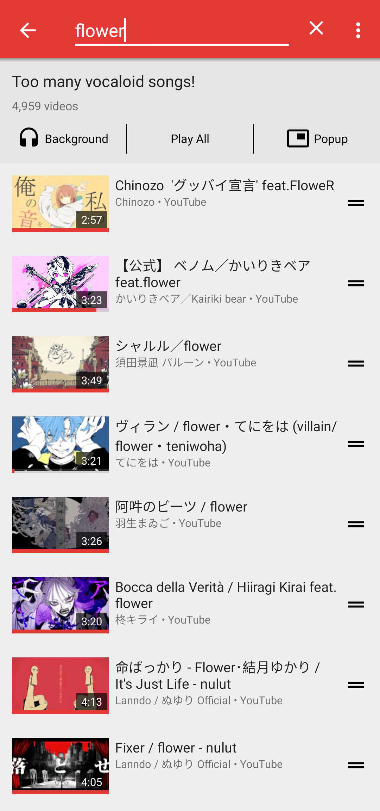

The project is hosted on both [CodeBerg](https://codeberg.org/NullPointerException/PipePipe) and [GitHub](https://github.com/InfinityLoop1308/PipePipe). Check both before you open an issue.

If you're enjoying PipePipe, please help share it with your friends. Every bit of support means a lot to us!

 
<h2 align="center"><b>PipePipe</b></h2>
<h4 align="center">
A FLOSS Android app to let you browse YouTube, NicoNico and BiliBili without accounts. </h4>
<h4 align="center">
NewPipe, but better - browse the most popular streaming platforms throughout the world.</h4>

## Features:

### Original

* Local subscription / playlists / history
* Comments & replies
* Built-in popup player
* Download video / audio / caption

### Beyond NewPipe

* Bullet comments / Live Chats
* Search filters
* Filter & sort local playlists
* Music player mode & Background playing
* SponsorBlock
* Timestamp support
* Sleep timer
* ... and many minor improvements

## Screenshots

 

 

## Contribute

Issues and PRs are welcomed. Please note that I will **NOT** accept service requests due to my limited time. 

Anyone interested in creating their own service is encouraged to fork this repository.

PipePipe is a HARD fork of NewPipe and the codebase is very different from NewPipe. 

## Donation

PipePipe is free and open source software. It is developed in my spare time. If you like it, please consider donating to support the development. With sufficient donations, I can dedicate more time to developing the project:)

Liberapay: https://liberapay.com/PipePipe

Ko-fi: https://ko-fi.com/pipepipe

## Special Thanks

[SocialSisterYi/bilibili-API-collect](https://github.com/SocialSisterYi/bilibili-API-collect) for providing some BiliBili API lists.

[AioiLight](https://github.com/AioiLight) for providing some code of NicoNico service.
